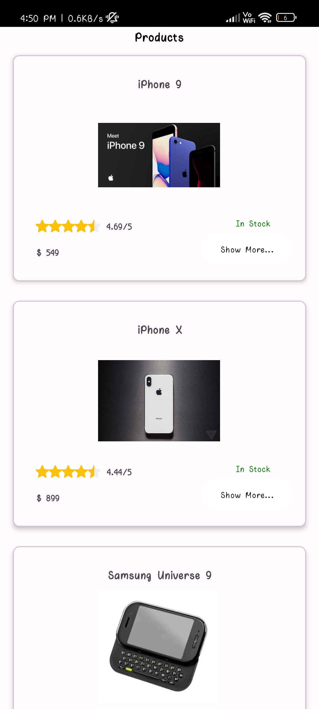
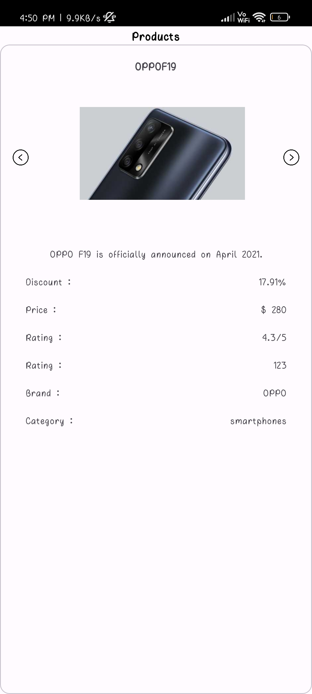
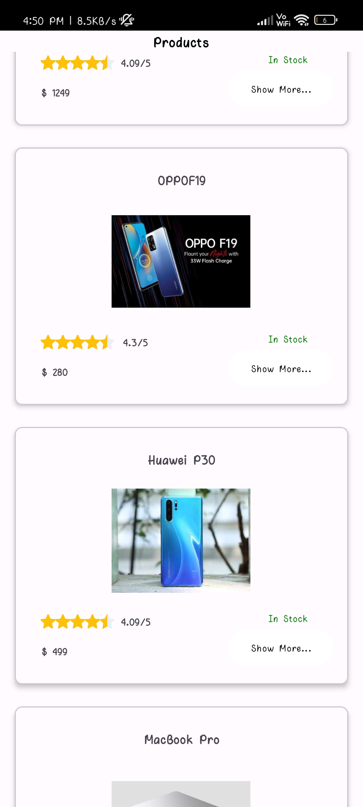
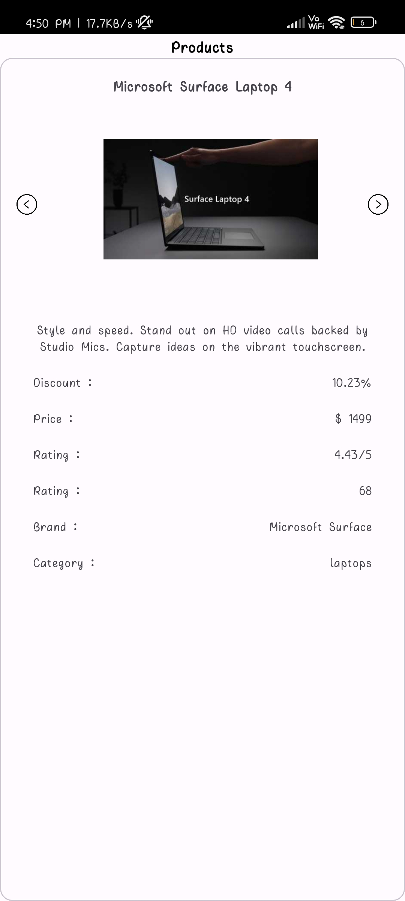

Lokal Assignment Application
============================

This is a sample Android app demonstrating the use of Retrofit for API calls, View Binding for layout handling, and RecyclerView for displaying a list of products.

Working Video Link :- 
==========
Video Link :- [Lokal Assigment](https://drive.google.com/file/d/1b1w6khH3xzlwZ0V_FGPzgTfHwgu2RkVY/view?usp=sharing)

Table of Contents
-----------------

-   Introduction
-   Project Structure
-   Dependencies
-   How to Run
-   Screenshots

Introduction
------------

The app fetches a list of products from a dummy JSON API and displays them in a RecyclerView. Each product can be clicked to view detailed information in a separate fragment. The project uses Kotlin, Retrofit for networking, View Binding for UI binding, and RecyclerView for displaying a list of products.

Project Structure
-----------------

The project is structured as follows:

-   `MainActivity`: The main activity that initializes and sets up the RecyclerView to display a list of products.

-   `ProductAdapter`: RecyclerView adapter responsible for binding product data to the views.

-   `DetailsFragment`: Fragment that displays detailed information about a selected product.

-   `ImageAdapter`: RecyclerView adapter for displaying images in the DetailsFragment.

-   `RetrofitInstance`: Singleton class for creating and managing the Retrofit API instance.

-   `ProductApi`: Retrofit API interface defining the endpoints for product data.

-   `Products`: Data class representing the structure of a product.

Dependencies
------------

The app uses the following dependencies:

-   Retrofit: For making network requests.
-   Gson Converter: For parsing JSON responses using Gson.
-   Glide: For loading and displaying images efficiently.

How to Run
----------

1.  Clone the repository.

    bashCopy code

    `git clone https://github.com/AvinashKumar077/LokalAssignment.git`

2.  Open the project in Android Studio.

3.  Build and run the project on an emulator or physical device.

Screenshots
-----------

